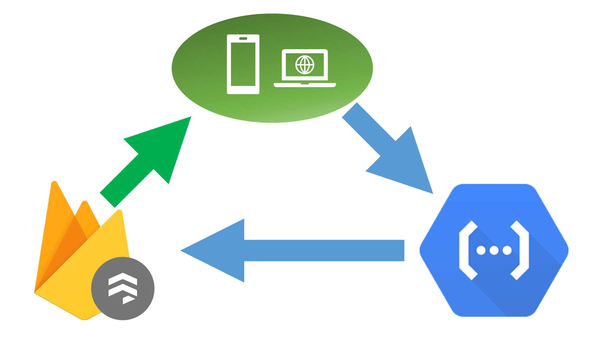

## Firestore read, Functions write - a sane way of using Firebase

    
First time I tried building an app entirely on Firebase I couldn't
get my head around it - simple things that as a backend developer
were trivial required applying complicated security rules that'll
put even JavaEE configuration to shame.

Regular backend programming starts from the assumption that a client
isn't allowed to do anything and gradually you add operations that 
a user is allowed to do.    
With Firebase it's the other way around, if a user can read a 
document he can read all of it and if he can write to a document
he can by default do anything to it. Programming in Firebase is
slowly adding exceptions to what a user can do.

In essence Firebase is about blacklisting what a user can't do while
server programming is about whitelisting what a user can do.

That's not a model I'm comfortable with and it's a hell on security.

But there's a sane way to work with Firestore (or Firebase'd old 
database) that won't make you pull your hairs out at every corner 
and isn't really mentioned much.

> Read from Firestore directly, write to it with Functions

The solution is simple - never write directly to Firestore. Instead
use Functions to write to the store with any arbitrary rule you want
and keep your security rules just about reading.

### Drawbacks of not writing directly to Firestore 

* __No offline writes__: one of the great advantages for using 
firebase is that it takes care of syncing your data for you and can
work offline. If you don't write directly to the database the 
Firebase SDK can't handle offline for you.    
That might not matter much though since transactions also can't
be done offline and with even simple workflows they can become the
majority of actions.

* __No immediate update__: using the Firebase SDKs if you write
directly to the datastore the client doesn't have to wait for 
the server to receive or acknowledge the requests and changes 
happen immediately. When using functions you have to wait for
data to propagate from the server back to your client.   
Like with offline this doesn't work with transactions and there's
also many times where the correct behaviour is to wait for 
acknowledgement.

* __Extra charge for using functions__: since we now add a Functions
api call for each write action we want to do, Firebase will charge
for Function access as well as Database/Firestore access.     
This can range from double your cost for write operations if you 
write to single document for each function invocation to inconsequential
if you write rarely and when you do you read and write to multiple
documents.

### A few gotchas and recipes

#### Displaying updates after function calls
When using Functions to update data a function call can
finish and return successfully before the data propagates
back to the client when using snapshot listeners.    

This can cause a delay on the UI - where the action finishes
successfully but it's effects on the UI take time to show.

There are 2 ways to solve this: 
* Instead of waiting for the function call to finish successfully
you can wait for the data to propagate o the client before showing
success on the UI.
* When a function finishes it should return the documents that
changed, and then those changes can be applied manually to the
ui. When the changes propagate via listeners, nothing will happen
since the data is the same.

#### Using custom claims for permissions

Since we use Functions for all our updates, we can also
add custom claims to users 
([see how here](https://firebase.google.com/docs/auth/admin/custom-claims)) 
and use those claims in security rules. It's great for
adding permissions to users such as admins or joining a 
group (note though that custom claims are limited to 1000 bytes)