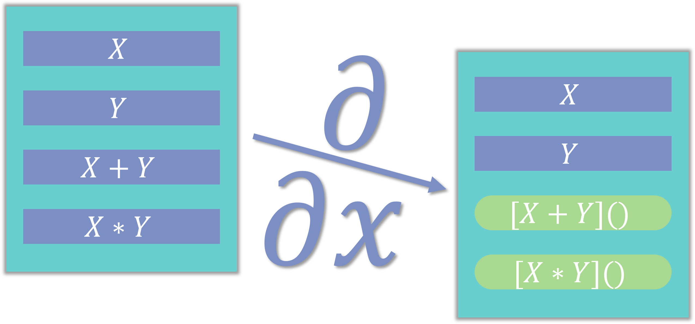

## Patterns for deriving state
### Common and advanced use-cases for deriving state in applications

I was going to write an article about why you should derive state and
not sync it manually, but [Kent C. Dodds](https://kentcdodds.com)
has written an excellent [article](https://kentcdodds.com/blog/dont-sync-state-derive-it)
on the subject.

So instead I'm going to go over a few common situations I've seen
throughout the years and how to handle them without syncing state manually.

### Filtering and sorting lists

Filtering and sorting lists or tables is a very common situation
in web development.    
The straightforward way is to keep a sorted list and resort it
as things get updated.

``` jsx
class SortedList extends React.Component {
    
    onFilterChange = (event)=>{
        const filter = event.target.value;
        const {sortKey} = this.state;
        const filteredList = this.props.list.filter(item=>item.text.indexOf(filter)>=0)
        this.setState({
            filter,
            sortedList:sortByColumn(filteredList,sortKey)
        })
    }
    sortByKey = (column) =>{
        const sortedList = sortByColumn(this.state.list,column);
        this.setState({
            sortedList,
            sortKey:column
        })
    }
    render(){
        const {sortedList,filter} = this.state;
        return <div>
            {sortedList.map(item=>
                <ItemView item={item} key={item.id} />
            )}
            <button onClick={()=>this.sortByKey("columnA")}>Sort by A</button>
            <button onClick={()=>this.sortByKey("columnB")}>Sort by B</button>
            <input type="text" value={filter} 
                onChange={this.onFilterChange}>Sort by A</button>
        </div>
    }
}

function sortByColumn(list,column){
     return list.sort((a,b)=>a[column]>b[column]?1:a[column] < b[column]?-1:0)
 }

```
Handling state like this manually is prone to errors in the future
when more functionality is added. We call `sortByColumn` from two
different places, and we'll need to do it for every different 
transformation we do on the original list.

If we derive sorting, we'll instead do this:

``` jsx
class SortedList extends React.Component {
    
    onFilterChange = (event)=>{
        const filter = event.target.value;
        this.setState({
            filter,
        })
    }
    sortByKey = (column) =>{
        this.setState({
            sortKey:column
        })
    }
    sortList(){
        const {list} = this.props;
        const {filter,sortKey} = this.state;
        const filteredList = list.filter(item=>item.text.indexOf(filter)>=0)
        return list.sort((a,b)=>a[column]>b[column]?1:a[column] < b[column]?-1:0)
    }
    render(){
        const {filter} = this.props;
        const sortedList = this.sortList();
        return <div>
            {sortedList.map(item=>
                <ItemView item={item} key={item.id} />
            )}
            <button onClick={()=>this.sortByKey("columnA")}>Sort by A</button>
            <button onClick={()=>this.sortByKey("columnB")}>Sort by B</button>
            <input type="text" value={filter} 
                onChange={this.onFilterChange}>Sort by A</button>
        </div>
    }
}
``` 

### Showing elapsed time

The usual way of showing a ticking clock from (or to) a certain time
is to use setInterval to update how much time is left.

```jsx
    function ticker(){
        const [time,setTime] = useState(0);
        useEffect(()=>{
            const intervalId = setInterval(()=>setTime(time+1),1000)
            return ()=>clearInterval(intervalId)
        })
        return <div>
            seconds elapsed {time}
        </div>
    } 
```

While this code works we are managing state that can be derived instead.
    
This approach breaks when we need to update the start time, 
show different granular times and when you consider that setInterval
doesn't really guarantee it'll run in exactly the time interval (it
only guarantees that it'll run after the specified time but if something
blocks it could run at any point in the future).

An often better approach is to save the original start date and
derive the elapsed time using the current time:

```jsx
    function ticker(){
        const [renderTimes,rerender] = useState(0);
        const now = new Date().getTime();
        const [start] = useState(now);
        //we use this to force the function to rerender every second
        useEffect(()=>{
            const intervalId = setInterval(()=>rerender(renderTimes + 1),1000)
            return ()=>clearInterval(intervalId)
        })
        return <div>
            seconds elapsed {Math.floor((now - start)/1000}
        </div>
    } 
```

I know force rendering is usually an anti-pattern, but there
really isn't another way in this case for us to tell react
when it should rerender.

If you are using mobx there's already a good utility function that does
exactly this - the 'now()' function from [mobx-utils](https://github.com/mobxjs/mobx-utils#now)

### Showing selected items in a checklist

A common pattern I've seen when creating a checklist is to put what 
items were selected inside the state that contains the options.    
For example let's try to build a list of things you can put in a burger:

```jsx
import React,{useState} from 'react';

// ToppingSelection receives props with the following structure (Typescript notation):
// {options:{text:string,value:string},selected:string[],onChange:(value)=>void}
class ToppingSelection extends React.Component {
    
    constructor(props){
        super(props);
        this.state = {
            optionsWithSelect:_.cloneDeep(props.options) // _ is for lodash, which I use for clarity
        }
    }

    handleInputChange = (event)=>{
        const value = event.target.name;
        const {optionWithSelect} = this.state;
        const index = optionWithSelect.indexOf(o=>o.value ===value);
        if (optionWithSelect[index].selected){
            this.uncheckOption(index);
        } else {
            this.checkOption(index);
        }
    }
    uncheckOption(index){
        const optionWithSelect = _.cloneDeep(this.state.optionWithSelect);
        optionWithSelect[index].selected = false;
        this.setState({
            optionWithSelect
        })
        this.props.onChange(optionWithSelect.filter(o=>o.selected).map(o=>({text:o.text,value:o.value}))
    }
    checkOption(index){
        const optionWithSelect = _.cloneDeep(this.state.optionWithSelect);
        optionWithSelect[index].selected = true;
        this.setState({
            optionWithSelect
        })
        this.props.onChange(optionWithSelect.filter(o=>o.selected).map(o=>({text:o.text,value:o.value}))        
    }
    render(){
        const {optionsWithSelect} = this.state;
        return <div>
            {options.map(option=>
                <label key={option.value}>
                    {option.text}
                    <input type={checkbox} checked={optionsWithSelect.checked}
                    onChange=(this.handleInputChange} name={option.value} />
                </label>
            )}
        </div>
    }
}
``` 

This isn't very good react code and perhaps a bit contrived as it's 
not even a fully controlled component but it's a very common pattern
in use and it's very enticing when your options object becomes more
complex.

It also disregards all selected choices if the list of options changes.    
Because it manages the state internally the function has to take care
to sync it's internal representation with external changes.

Instead:

```jsx
// ToppingSelection receives props with the following structure (Typescript notation):
// {options:{text:string,value:string},selected:string[],onChange:(value)=>void}
class ToppingSelection extends React.Component {

  handleInputChange = (event)=>{
      const value = event.target.name;
      if ( selected.includes(value)){
          onChange(selected.filter(option=>option !== value));
      } else {
          onChange(selected.concat(value));
      }
  }
  render(){
      const {options,selected} = this.props;
        return <div>
            {options.map(option=>
                <label key={option.value}>
                    {option.text}
                    <input type={checkbox} checked={selected.includes(option.value)}
                    onChange=(this.handleInputChange} name={option} />
                </label>
            )}
        </div>
  }
}
```

Yes we are actually iterating over all the selected array for each option
so this is more or less an O(n^2) operation where n is the number of options.
(O(n^2) is a [Big O notation](https://en.wikipedia.org/wiki/Big_O_notation) 
This won't be close to a performance issue if the number of options is
small and if the number of options is big enough to become an issue
than you probably need to consider a different UI paradigm 
then a checklist.

There are also ways to make this function perform at O(n), which is
equivalent to the previous example in performance but in exchange
for a much more verbose and complicated code.

##  Deriving state isn't limited only to the view layer

Most examples for deriving state focus on how to limit syncing state
inside a component, but in larger applications we often keep much of
our state outside the view layer - inside the logic layer (controller
in MVC, or stores for most state management frameworks these days).

It's also important to limit what state you derive inside you logic
layer - even with frameworks that discourage syncing state such as redux.

Take for example the same list sorting example from before, but
this time written in redux:

```js
    function sortingReducer(state,action){
      switch (action.type){
        case actionTypes.SORT_BY:
          const key = action.payload;
          return {
            list:state.list.sort((a,b)=>a[key]>b[key]?1:a[key]<b[key]?-1:0),
            sortKey:key
          }     
          default:
            return state;
      } 
    } 
``` 

By manually sorting inside our store we'll have to take care to sort the list
again if a different action causes the list to change.

Instead to derive the state we would write it like this:

```js
    function sortingReducer(state,action){
      const key = action.type === actionTypes.SORT_BY?action.payload:state.sortKey;
      return {
        list:state.list,
        sorted:state.list.sort((a,b)=>a[key]>b[key]?1:a[key]<b[key]?-1:0),
        sortKey:key
      }   
    } 
``` 

This is less performance, but as always if performance becomes an issue
there are ways around it by using memoization.

### Setters for derived state

When your stores expose a derived property, we often want to be able
to change that derived property. We can do so by creating actions that
take the new derived state and infer the proper original state.

For example let's take a store that keeps a time interval for
displaying a graph at a certain range. We would like to keep the 
store simple and use only time in days, but for the user we would
like to show dates that are more human readable (I.E. 1 week, 4 months, etc...)

An example for such a store that uses derived state would look something
like this:
```js
    function timeRangeReducer(state,action){
      let days = state.days;
      if (action.type === actionTypes.SET_DAYS){
        days === action.payload;
      }  
      return {
        days,
        formatted: days > 14? `${Math.floor(days / 7)} weeks`:days>1?`${days} days`:'1 day' 
      }
    } 
``` 

Instead of exposing just a function that changes the day and letting
the user (usually the view layer) be in charge of converting from
our derived state to the internal representation, we could expose a
setter for the formatted field:

```js

    function setSetDays(days){
      return (dispatch,getState)=>{
        dispatch({
          type:actionTypes.SET_DAYS,
          payload:days
        })
      }
    }
    function setFormatted(formatted){
      return (dispatch,getState)=>{
        const [count,unit] = formatted.split(" ");
        const days = unit === "weeks"? count * 7: count;
        dispatch({
          type:actionTypes.SET_DAYS,
          payload:days
        })
      } 
    }
```
This is a bit of a contrived example since you should probably format
this inside the component and not in the store, but it'll do to explain
the point.

In _mobx_ we can do this by creating a setter for a computed property:

```js
    class TimeRangeStore {
      @observable
      days;

      constructor(days){
        this.days = days;
      }     
      
      @computed
      get formatted(){
        const {days} = this;
        return days > 14? `${Math.floor(days / 7)} weeks`:days>1?`${days} days`:'1 day'
      }
      
      @action
      set formatted(value){
          const [count,unit] = value.split(" ");
          const days = unit === "weeks"? count * 7: count;
          this.days = days;
      } 
}
``` 
 
### Why I used class syntax for most examples and not hook syntax

I originally tried to write all the examples using the new hook syntax,
however it became obvious very quickly that writing examples of
syncing states manually with hooks results in very convoluted code
that doesn't seem like anyone would actually use.   
Since I've seen instances of these cases being used often with class
syntax and haven't had the pleasure of seeing anyone using it with
hook syntax, I've opted to write the bad code examples using what
I've actually seen in practice.    

Since I wrote the bad examples in class syntax I've opted to show
the good examples in class syntax too, both to not imply a
preference of one syntax over the other in this article and so
that the changes would be more directly apparent.

That said I think the fact that hooks are naturally a single function
and imply a certain linear flow makes writing unnecessary state management
harder - and writing derived state more natural. 

> Hooks make writing react code using best practices more natural

Here's the hook syntax code for both examples which were written
in class syntax:
__Filtering and sorting lists__
``` js
function sortedList(props){
    const {list) = props;
    const [filter, setFilter] =  useState("");
    const [sortKey, setSortKey] = useState(null);
   
    const filteredList = list.filter(item=>item.text.indexOf(filter)>=0)
    const sortedList = list.sort((a,b)=>a[column]>b[column]?1:a[column] < b[column]?-1:0);
    return <div>
        {sortedList.map(item=>
            <ItemView item={item} key={item.id} />
        )}
        <button onClick={()=>setSortKey("columnA")}>Sort by A</button>
        <button onClick={()=>setSortKey("columnB")}>Sort by B</button>
        <input type="text" value={filter} 
            onChange={setFilter}>Sort by A</button>
    </div>    
}
```
__Showing selected items in a checklist__

``` js
function ToppingSelection(props){
    const {options,selected,onChange} = props;
    
    function handleInputChange(event){
        const value = event.target.name;
        if ( selected.includes(value)){
            onChange(selected.filter(option=>option !== value));
        } else {
            onChange(selected.concat(value));
        }
    }
    return <div>
        {options.map(option=>
            <label key={option.value}>
                {option.text}
                <input type={checkbox} checked={selected.includes(option.value)}
                onChange=(this.handleInputChange} name={option} />
            </label>
        )}
    </div>
}
```