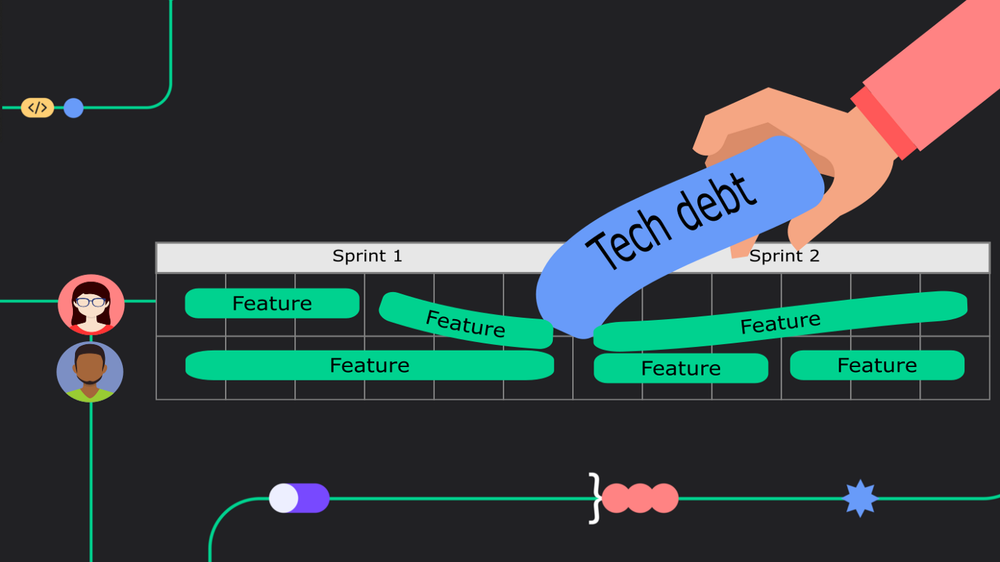
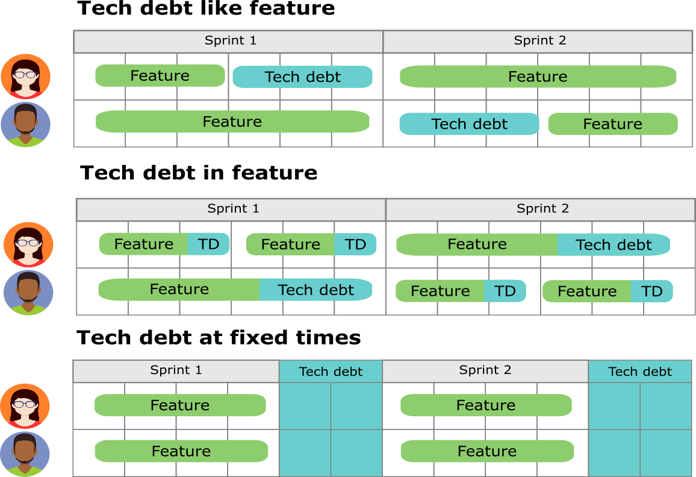
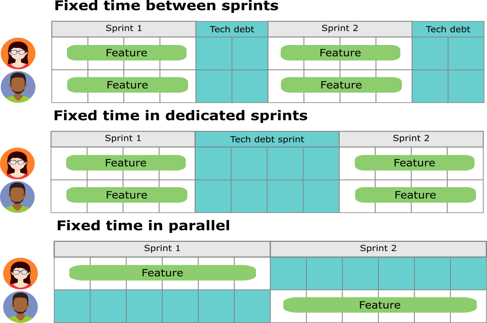
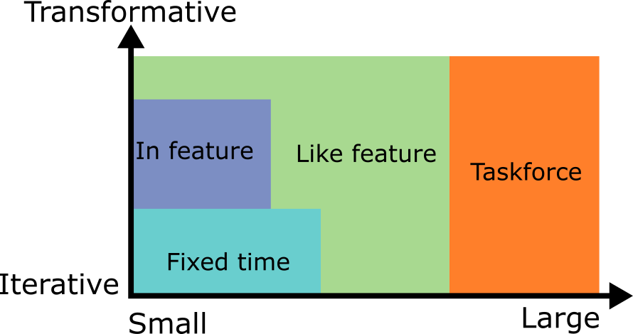
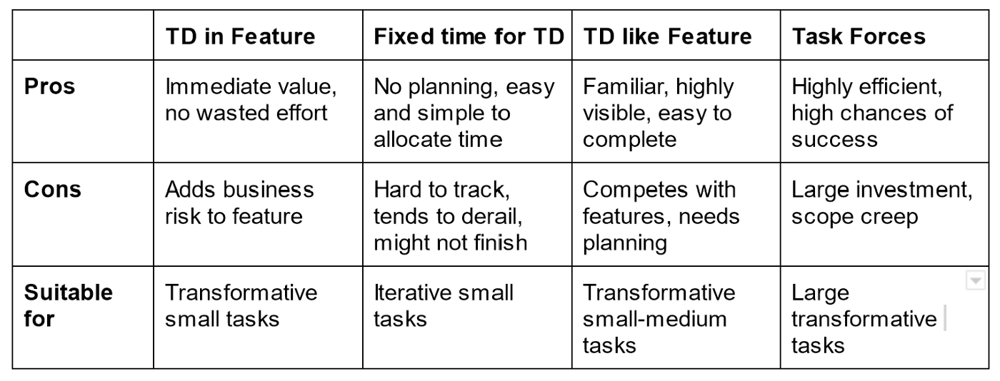

# Tech Debt is a Marathon Not a Sprint
## Strategies and considerations on how to schedule Tech Debt work

The hardest thing about tech debt is allocating the time to address it.

Have you ever heard someone tell you “we spend 20% of our time on tech debt”,
or have you ever been asked to “dedicate” a certain percentage of your time
to it?

What does that actually look like?

Being a tech lead at Melio for the past two years (and coding professionally
since 2009), I’ve had to answer this question quite a lot.

Melio is a hyper-growth startup, where things change very rapidly — velocity
is one of the major keys to success and we care deeply about the user’s
experience.     
There are always pressing features, great value we can give
users right now and time sensitive opportunities to pursue.

Trying to dedicate a chunk of time naively doesn’t work. Just as other 
parts of our company evolved — our strategy for dealing with tech debt 
had to adapt with it.

We ended up working with 4 different strategies:

* **Tech Debt like Feature**    
    Scheduling tech debt tasks like any other roadmap tasks
* **Tech Debt in Feature**    
    Taking chunks of time inside features to handle tech debt
* **Fixed Time for Tech Debt**    
    Setting up a dedicated fixed chunk of time
* **Task Forces**    
    Spawning dedicated task forces to handle tech debt

Efficiently dealing with tech debt means juggling between different 
approaches until you find the combination that fits your current situation,
and constantly iterating on it as circumstances change — **Tech debt is a 
marathon not a sprint.**

## Tech Debt like Feature

Treating tech debt like features, means you schedule them like any other
task - if you make yearly or quarterly roadmaps, these tasks go in your
roadmap.    
If you plan sprints, these take a chunk of your sprint.

### Pros:

* **Familiar processes**   
    By scheduling tech debt as any other task, you use the same tools as you
    would for features, making it easier to manage and track.
* **High visibility**   
    Scheduling tasks as part of the roadmap, means business has direct 
    visibility into the timeline and value of a task, and can keep track 
    of it
* **High likelihood of completion**   
    Since there are defined goals and a plan, once a task has started it 
    is more likely to be finished, even if it overflows the allotted time
    (like any other feature)

### Cons:

* **Competes with features**   
    Since it’s part of the roadmap, it also follows that it gets prioritized
    like anything else in the roadmap. Which often means the tech debt gets
    delayed
* **Requires planning and estimations**   
    Since you need to put it in the roadmap, you’ll most likely need to 
    define milestones, do research and estimation. This is often more work 
    than you want to put into most tech debt

### Most suitable for:

* **Transformative tasks**   
    The initial stages of a refactor, tasks that are contained and have 
    distinct reachable milestones. Research heavy or iterative parts of 
    refactoring with no end goal in sight are usually hard to schedule in
    this way
* **Medium-sized tasks**   
    It’ll add too much effort to plan and schedule a bunch of small tasks,
    and large tasks will usually overwhelm the cost-value analysis compared
    to delivering features. So this method of scheduling is often suitable
    for medium sized tasks

>    **Note about refactoring**:    
> 
> I find that a lot of refactors tend to follow a pattern — at first 
> there’s the POC, the infrastructure work where new capabilities are a
> dded.   
> After that initial phase, there’s a longer phase, where more and more
> parts of the codebase are transferred to the new way of doing things.

## Tech Debt in Feature

Tech debt inside features means that when you plan and estimate a feature,
you also plan tech debt work in areas that are relevant to that feature
and include that work as part of the feature estimation.

### Pros:

* **Immediate value**    
    Since the tech debt is relevant to the next feature, the impact of the work is felt immediately. Sometimes it can make features take less time than originally planned
* **No wasted effort**    
    Flip side of having immediate value, is that there is never wasted effort in refactoring areas of the code you never actually end up working on

### Cons:

* **Adds risk to features**    
    Adds risks to and often extends the timeline of a feature. Since the tech debt needs to be addressed first, it usually also delays the critical step of discovering the potential complications that were unknown

### Most suitable for:

* **Iterative refactors**    
    Iterative ongoing refactors benefit the most from this method. As the initial risk has already been taken in the initial push to add the capability and the task is often well defined
* **Small to medium tasks**    
    It’s usually hard to justify adding a lot of extra time to a feature for tech debt. 30% is often the top, when it becomes more reasonable to treat the tech debt as its own task — usually limiting this method to smaller tasks

## Fixed Time for Tech Debt

Setting a fixed time in the roadmap, means you define a known amount o
f time to do tech debt work, without exactly specifying what tasks are
worked on or fitting tasks in.

This type of scheduling usually looks like one of the following:

* **Dedicated time between sprints** — if you are working in sprints, you can have a “free” week between sprints to deal with code debt
* **Dedicated sprints** — a backlog sprint every two sprints, or 1 sprint every quarter, etc.
* **Parallel work** — 1 person every sprint/quarter/timeframe does backlog tasks 

### Pros:

* **No planning required**    
    No estimations or research — if you know what needs to be done, fixed time adds no extra work
* **Easy to allocate**   
    Do you want to spend 25% of your resources on maintenance work? Just set one week every month to focus on tech debt — Done    
    If business wants to allocate resources to tech debt, but competing priorities always get in the way, fixed time is the easiest to manage

### Cons:

* **Hard to track**    
    By setting a fixed time, you are managing resources not work — it’s hard to track what is being done, its value and when it’s making progress
    Easy to fill with other work Fixed time can often fall into “free time”, every non-coding task that gets postponed because of tight deadlines creeps into it. This might be an advantage at times, but it means you do less tech debt
* **Work might not get finished**    
    Fixed time means there’s a lot of pressure to start feature work, and when tasks inevitably get underestimated it’s more likely they will be left half-done or shelved until the next time, instead of letting the tech debt work overflow into feature time

### Most suitable for:

* **Iterative refactors**    
    Long-running refactors, where components are moved from an old architecture to a new architecture one by one. This works well with this method, as it is usually easy to stop in the middle and there’s often not much to plan in such endeavors
* **Small tasks**    
    Fixed time usually works quite well with a backlog of small tasks collected over time

## Tech Debt Task Forces

A dedicated task force is very similar to the Tech Debt like Feature method.    
However the main difference, is that those who are part of that task force
get extracted from the regular planning and resource allocation.

### Pros:

* **High efficiency**    
    Taking team members out of the day-to-day, and having them work side by side, can provide the conditions to complete otherwise untackable tasks. This can greatly reduce the overall time tasks can take, especially when tech debt involves multiple different teams who must work together
* **High probability of completion**    
    With the amount of resources expended, the tech debt is going to be addressed one way or another

### Cons:

* **Large investment**    
    Taking people out of the context of the team is a serious commitment, and often hard to justify
* **Scope creep**    
    Task forces for handling tech debt can easily get out of hand, as scope tends to creep into the task, more use cases are added and architecture becomes more generic

### Most suitable for:

* **Transformative tasks**    
    The only tasks that really justify the resource expenditure and risk a task force entails, are tasks that can’t reliably be split into distinct parts, are an all or nothing type, or involve a lot of uncertainty
* **Large tasks**    
    This method is really only viable for the larger types of tasks that require considerable commitment
* **Tasks spanning multiple teams**    
    Coordinating tech debt work between the schedules and priorities of multiple teams is hard, task forces make this a lot easier

## Example in Practice

Dealing with tech debt practically, means choosing the right type of 
scheduling strategy for the work that needs to be done and the time 
and context it is done in.

There’s no right strategy for every company, and a healthy tech debt 
strategy usually involves a mix of different strategies.

More than that, a single piece of tech debt can have multiple 
strategies during its lifecycle.

For example, in Melio we migrated our frontend from flow to typescript(a technology refactor).

There was no practical way to do this kind of migration in a single batch, 
so we had to do it iteratively:

1. We scheduled a backlog task into the sprint **like a feature** — the 
   initial infrastructure to get typescript and flow working side by side 
   and a few examples.
2. For a few sprints every feature we did that had flow files had to be 
   moved to typescript — making the refactor work **inside other features**.
3. For the last leg we dedicated a week where a **task force** of several 
   developers worked on moving the rest of the flow code into typescript.

## Choosing the right method

While in the end there’s no golden rule that fits every organization 
and every context, I find that a lot of times we can set tech debt on
two axes:

**_small->large_** axis and a **_iterative->transformative_** axis

Once you can categorize the task on these two axes, it becomes easier 
to find the right way to tackle it using this chart:

large and iterative->transformative" />

