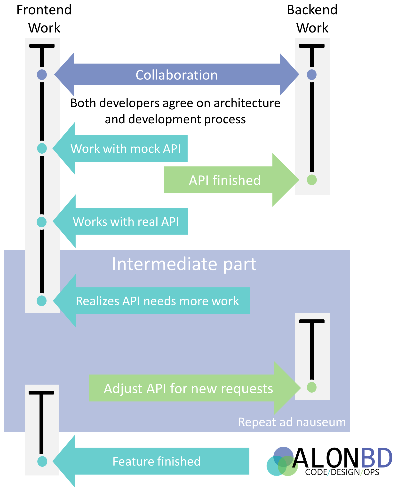

## What it means to be a Fullstack Developer  

  
Lately when I talk about fullstack development a lot of people proclaim
their skepticism on the subject - saying that fullstack engineers don't
exist or that most developers, if not all, are only suitable to either
backend or frontend work.

The criticism mostly boils down to two issues:

* No one can be an expert at both frontend and backend, it's better to
  specialize 
* Most people are only suitable for either frontend or backend work.

These critiques miss the entire point of what fullstack is.

### Fullstack isn't about code, it's about _ownership_

Fullstack isn't about what languages you know or what technologies you
mastered it's about having the tools  and authority to deal with a task
from start to finish and getting rid of obstructions. 
   
Splitting a single task into different responsibilities and handing 
them to different people creates unnecessary detachment, adds superfluous 
coordination and often can prevent simple cross-layer solutions.   

Let's consider a common web development task that requires a simple
new api from a backend developer and a bit more work front the frontend
developer - for example showing a graph of some new metric or activity.

The timeline for development of such a feature often looks like this:

When scope changes or new knowledge about the task comes to light 
adjustments need to be made to the original architecture and one 
developer becomes a bottleneck for the other - preventing continuous
work, adding pressure to each side and causing painful context switches
that can sometimes lead to resentment and conflict.

Since most work is sequential in nature (in the illustrated example the
frontend dev requires the api to work) until a prerequisite task is done
one of the developers must wait or rely on workarounds (in the 
illustrated case - using a mock api).
 
And above all - many times a difficult problem in one layer has a simple
solution in a different layer and when a developer is just frontend or 
just backend they often become blind to solutions to business issues 
from outside their own domain.

### Advantages of doing fullstack development

* **No bottlenecks** - not having to wait for another person before you
can continue working.
* **Faster iteration** - being able to change the api and see the results
on the client, change the ui and see how it handles the new api and doing
so continuously..
* **Visibility to and from stakeholders** - being able to show progress
and communicate using the visual part of the application helps to both
connect and relate to stakeholders.
* **Ownership** - a single point of contact for interested parties (
stakeholders, qa, product, management) makes communication and 
management easier and provides a sense of responsibility.

### Anyone can do Full-Stack

To answer the criticism that not everyone can do fullstack, I'd like to
point out that what we consider frontend was backend a few years 
ago, especially the hard parts - routing, state management, caching, 
even business logic is now done routinely on the frontend.   

The majority of frontend issues don't require detailed knowledge of 
design languages, ui performance or browser compatibilities - it's usually
just adding a few divs and changing some css values (assuming your client
is web-based).   

Similarly the majority of backend issues don't require detailed knowledge
of concurrence models, bytecode manipulation or ORM internals - it's
usually just adding a new field to the database or api model.

Being fullstack doesn't mean being an expert in all things, it doesn't
mean doing everything on your own - owning and developing a feature in
an area you are less strong at doesn't mean you can't get help, you 
should definitely ask for guidance and instructions from those who
are more experienced and specialize in that area.    

### You can still specialize while doing Full-Stack

Being fullstack doesn't mean you can't specialize or become an expert
on a topic.    
Frankly saying that one can't master both frontend and
backend implies that if you concentrate on just one layer you can 
master it - which is absurd, there are so many areas in frontend
and backend that it is impossible for anyone to be an expert in all
aspects of development in a layer.

You can be fullstack and be an expert in using graphing libraries.     
You can be fullstack and be an expert in using ORMs.

Just like any other developer a fullstack will eventually develop 
expertise in certain areas and it's natural to send the more complex
tasks in those areas to developers who specialize in them.

> _Don't split your developers into layers_

### Is fullstack always applicable

No. Of course not. People have been splitting development into 
different layers for years and there is value in it.    
If your development process involves a lot of planning and your 
specifications are air-tight, there are benefits to having different 
people doing different layers.    

But if you are doing web development with agile processes you will
probably gain a lot by moving to a more fullstack oriented process.

#### Footnotes

Since this article is probably going to be a contentious with a lot of
people I'll try and head off a few critiques:

* While a lot of the examples in this article focuses on frontend, the
benefits of fullstack development doesn't just make frontend work easier,
backend development also suffer from the same issues and enjoy
the same benefits.
* In fact fullstack development isn't really about just backend and 
frontend, it's a change in process and applies to the entire stack - a 
backend developer shouldn't need to wait for a dba to approve an sql 
script on a database or for devops to add his feature to the CI. When
doing frontend work you shouldn't wait for a UI designer to crop an
image for you.
* You might get the impressions from this article that you should never
split your tasks. That's not at all what I'm getting at - you should
really split your tasks into manageable stories - but split them by
feature and function, not into layers.
